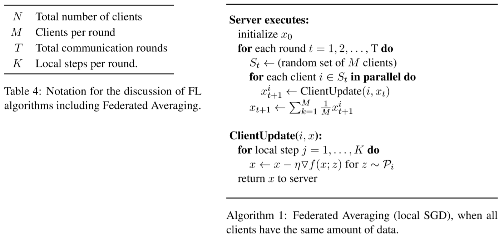
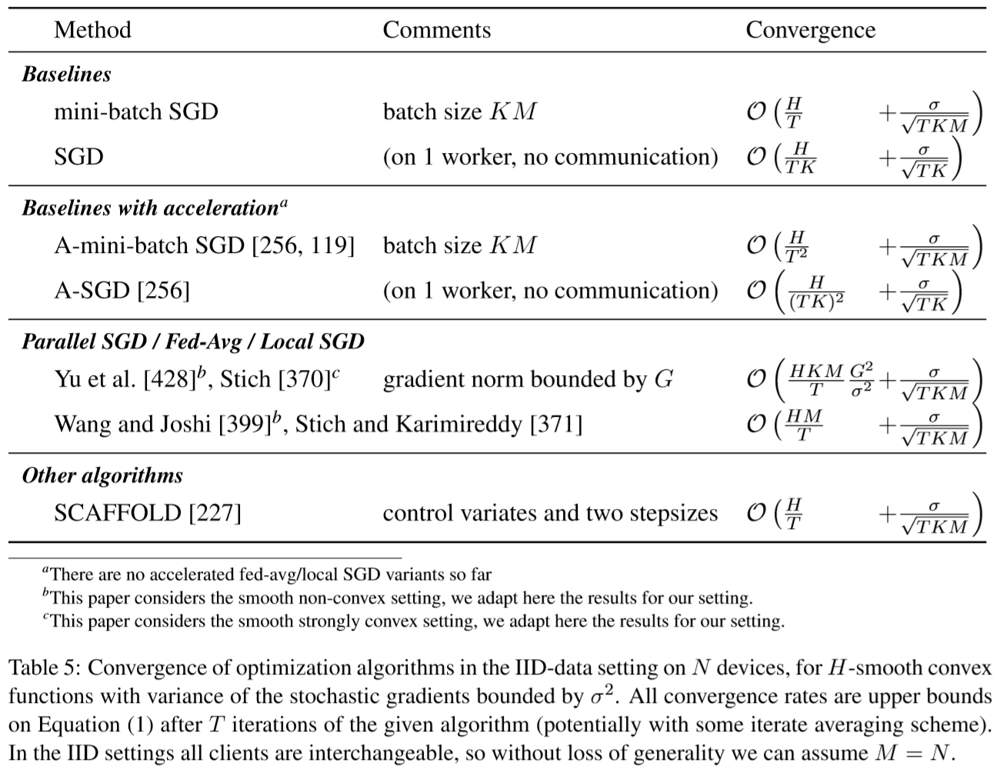
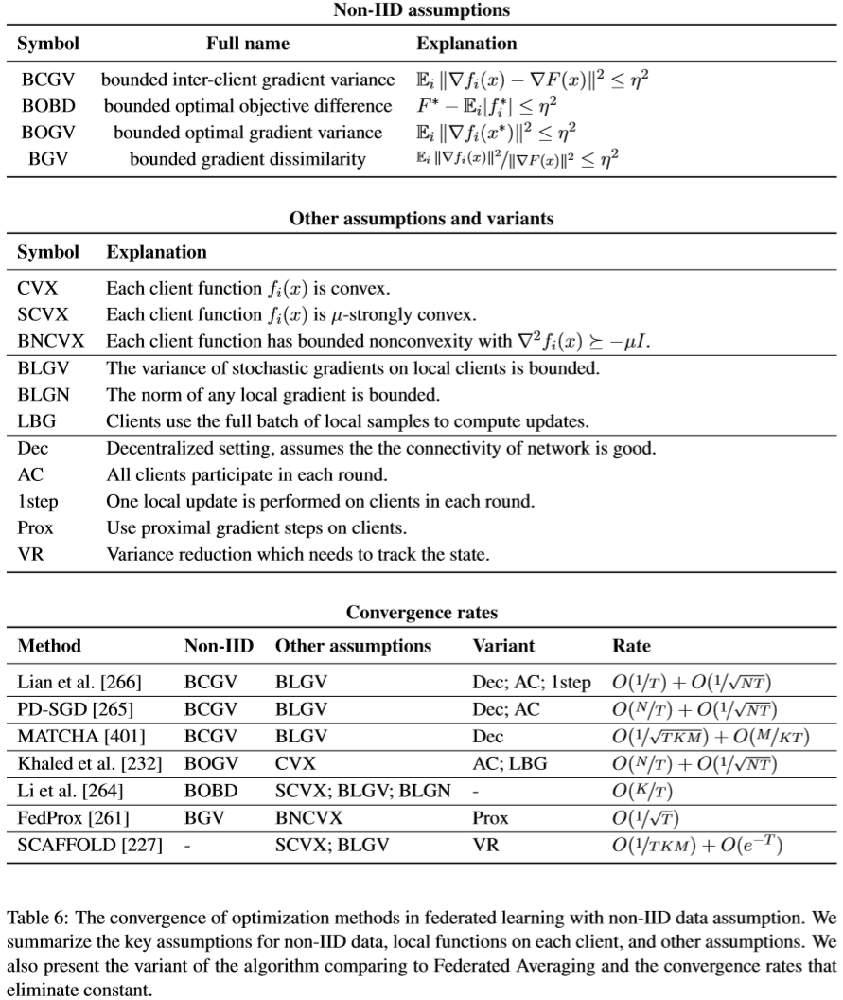

# 3 效率与有效性的提升

在本节中，我们会探索各种技术和开放式的问题，以解决使联邦学习更加高效和有效的挑战。这包含了无数种可能的方法，包括：探索更好的优化算法；提供不同的模型给不同的客户端；让诸如参数搜索、结构搜索和调试机器学习任务在联邦学习中更加容易；提高通信效率等等。

解决这些目标的一个基本挑战就是non-IID(非独立同分布)数据的存在，因此，我们首先分析这个问题，并分析可能的缓解方法。

## 3.1 联邦学习中的Non-IID数据

虽然通常情况下IID的含义很清楚，但是数据non-IID则有很多种可能。在本节中，我们提供了一种对于non-IID数据的分类方法，对任何客户端分区的数据集可能出现的数据non-IID情况进行分类。最常见的独立但是非同分布的来源是每个客户端对应着一类特定的用户，一片地理区域，或者一段特定的时间。这个分类法与数据漂移的概念有密切的关系[304, 327]，它研究训练分布和测试分布之间的差异。这里，我们仅考虑每个客户机上数据分布的差异。

对于以下内容，我们假设一个监督任务有特征$x$和其对应的标签$y$。联邦学习的统计模型涉及到两个层面的采样： 第一层是对客户端$i \sim Q$进行采样（可用客户端上的分布），第二层是对客户端本地数据分布进行采样$(x,y) \sim \mathcal{P}_i(x,y)$。

当在联邦学习中提到数据non-IID时，我们通常指的是客户端$i$和客户端$j$所对应的$\mathcal{P}_i$与$\mathcal{P}_j$不同。然而，有一点需要我们特别注意的是：$\mathcal{Q}$和$\mathcal{P_i}$是可能随着时间的推移而改变，从而导致另一维度上的non-IID。

为了完整起见，我们注意到，即使在单个设备上的数据，如果数据没有经过充分的随机打乱顺序，比如：按照时间排列，那么本地数据的独立性也无法保证。

**非同分布的客户端分布** 根据Hsieh et al.[205]，我们首先研究了数据偏离同分布的一些常见方式，即客户端$i$和客户端$j$的分布不同。我们将$P_i(x,y)$重写为$P_i(y|x)P_i(X)$和$P_i(x|y)P_i(y)$让我们能够更加准确地描述他们的区别。

- *特征分布倾斜（协变量飘移）*：即使共享$\mathcal{P}(y|x)$，不同客户端上的边缘分布$\mathcal{P}_i(x)$也可能不同$^4$。比如，在手写识别领域，用户在书写同一个单词时也可能有着不同的笔画宽度、斜度等。

- *标签分布倾斜（先验概率飘移）*：即使$\mathcal{P}(x|y)$是相同的，对于不同客户端上的边缘分布$\mathcal{P}_i(y)$也可能不同。比如，当客户端与特定的地理区域绑定时，标签的分布在不同的客户端上是不同的。比如：袋鼠只在澳大利亚或动物园里；一个人的脸只在出现在全球的几个地方；对于手机设备的键盘，某些特定人群使用某些表情，而其他人不使用。

- *标签相同，特征不同（概念飘移）*：即使共享$\mathcal{P}(y)$，不同客户端上的条件分布$P_i(x|y)$也可能是不同。由于文化差异，天气影响，生活水平等因素，对于相同的标签$y$，对于不同的客户端可能对应着差异非常大的特征$x$。比如：世界各地的家庭图片千差万别，衣着也千差万别。即使在美国，冬季停放的被大雪覆盖汽车的图像只会出现在某些地区。同样的品牌在不同的时间和不同的时间尺度上看起来也会有很大的不同：白天和晚上、季节效应、自然灾害、时尚设计潮流等等。

- *特征相同，标签不同（概念飘移）*：即使$\mathcal{P}(X)$是相同的，对于不同客户端上的条件分布$P_i(y
  |x)$也可能不同。由于个人偏好，训练数据项中的相同特征向量可能具有不同的标签。例如，反映情绪或下一个词预测词的标签有着个人和地区差异。

- *数量倾斜或者不平衡*：不同的客户可以拥有着样本数量差异很大的数据。

在现实世界中，联邦数据集可能同时受到包含多个上述影响，同时如何去刻画现实世界中的跨客户端之间的数据集的分割是一个重要的开放性问题。大多数关于合成的non-IID数据集的工作(例如[289])都集中在标签分布倾斜上，在这种情况下，non-IID数据集是通过基于标签划分现有数据集的“平面”而形成的。为了更好地理解真实世界的non-IID数据集的性质，我们允许构建受控的但真实的non-IID数据集，用于测试算法和评估它们对不同程度的客户端异构的恢复力。

此外，对于不同的non-IID分布可能需要制定不同的缓解策略。例如：在特征分布倾斜的情况下，因为$\mathcal{P}(y|x)$被假设是共同的，这个问题至少在理论上是很清楚的，训练一个全局模型去学习$\mathcal{P}(y|x)$将是合适的。当同一个特征在不同的客户端上被映射到不同的标签上时，某种形式的个性化（详见3.3）可能对学习真正的标签函数很重要。

**违反独立性** 在训练过程中，只要概率分布$\mathcal{Q}$发生变化，就会其导致违反独立性。一个具有代表性的例子，在跨设备联邦学习中，设备通常需要满足特定的要求才能够参与训练（详见1.1.2）。设备通常在本地的夜间时间满足这些要求（当它们大概率在充电、使用免费wi-fi和空闲时），因此设备可用性可能存在明显的昼夜不同。更进一步的，因为当地的时间直接对应着经度，因此数据的来源就存在着非常大的地理偏见。Eichner等人[151]描述了这个问题和一些缓解策略，但是仍然有许多问题是待解决的。

**数据集飘移** 最后，我们注意到了分布$\mathcal{Q}$和$\mathcal{P}$对于时间的依赖性可能引入传统意义上的数据集偏移（训练节和测试集在分布式上的不同）。此外，其他的条件可能会使有资格训练联合模型的客户端集合与模型被部署的客户端集合不同。例如，训练比推理可能要求设备拥有更大的内存。这些问题将在第6节被更深入的探讨。采取技术来解决数据集飘移对于联邦学习来说是另一个有趣的开放性问题。

### 3.1.1 处理Non-IID数据的策略

联邦学习的最初目标是在客户端数据集的联合上训练单个全局模型，而使用non-IID数据则使其变得更加困难。一个自然的方法就是修改现有的算法（例如：通过不同的参数选取）或者探索一种新的方法更高效地达到这个目标。本节的3.2.2将讨论这方法。

对于某些应用程序，可能可以增加数据以使不同客户端的数据更加相似。一种方法是创建一个可以全局共享的小数据集。这个数据集可能来自一个公开可用的代表性数据源，一个不涉及隐私敏感的独立于客户数据的数据集，或者可能是原始数据的蒸馏结果（参考Wang等人[404]）。

客户目标函数的异构性使得如何构建目标函数的问题变得更加重要——现在已经不清楚平等地对待所有的样本是否是有意义的。替代方案包括：限制任何一个用户的数据贡献（这对隐私也很重要，见第4节），并在客户端之间引入其他公平概念；参见第6节中的讨论。

但是，如果我们能够在每个设备上的本地数据上运行训练（这对于全局模型的联合学习是必要的），那么训练单个全局模型是否是正确的目标呢？在许多情况下，使用单个模型是首选地，例如：为了向没有数据的客户端提供模型，或者在为了在部署之前允许进行人工验证和质量确认。然而，由于本地培训是可能的，因此每个客户都有一个定制的模型是可行的。这种方法可以把non-IID问题从一个bug变成一个特性，几乎是字面上的意思，即因为每个客户端都有自己的模型，客户端能够独立地参数化模型，看起来有些病态但缺让non-IID变得不那么重要。例如：对每一个$i$，$\mathcal{P}_i(y)$只支持一个标签，那么找到一个高精度的全局模型可能是非常具有挑战性的（特别是当$x$的信息相对不足时），但是训练一个高精度的局部模型是微不足道的（只需要一个持续的预测）。这种多模型方法将在第3.3节中深入讨论。除了解决非独立的客户端分布之外，使用多个模型还可以解决由于客户端可用性变化而导致的违背独立性的问题。例如，Eichner等人[151]的方法使用单个训练运行，但对不同的迭代进行平均，并为时区/经度的客户端推断提供不同的模型。

## 3.2 联邦学习的优化算法

在典型的联邦学习任务中，目标是学习单个全局模型，该模型最小化整个训练数据集上的经验风险函数，训练集数据为所有客户端数据的并集。联邦优化算法和标准分布式训练方法之间的主要区别是需要处理表格 1中的特征——对于优化特别突出的特性有：non-IID和不平衡的数据、有限的通信带宽、不可靠和有限的可用设备。

当联邦学习在设备的总数非常庞大时（如：跨移动设备），每轮只需要一些客户端参与（客户端采样）。此外，每个设备都可能多次参加训练给定的模型，因此算法应当是不状态依赖的。这就排除了直接应用在数据中心上下文中非常有效的各种方法，例如：ADMM之类的有状态优化算法，以及根据前几轮遗留的压缩错误修正更新的有状态压缩策略。

联邦学习算法的在现实中另一个重要考虑是与其他技术的可组合性。优化算法并非在生产部署中独立运行，而是需要与其他技术结合使用，如：第4.2.1节中的加密聚合协议、第4.2.2节的差分隐私(DP)和3.5节中的模型和更新压缩。如第1.1.2节所述，这些技术中有许多可以应用于基本类型，如“对选定的客户机求和”和“向选定的客户机广播”，以这些基本形式表达的优化算法提供了一个有价值的关注点分割，但也可能排除某些技术，例如：通过异步更新。

联邦学习最常用的优化方法之一是联邦平均算法[289]，它适用于本地更新或并行的SGD。在这里，每个客户机在本地运行一些SGD步骤，然后对更新后的本地模型求平均值，以在协同服务器上形成更新的全局模型。伪代码在算法1中给出。

执行本地更新并减少与中央服务器的通信频率，解决了在面对数据位置限制和移动设备客户机有限通信能力情况下的核心挑战。然而，从优化理论的角度来看，这类算法也带来了一些新的算法挑战。在第3.2节中，我们分别讨论了数据跨客户端分布IID和non-IID情况下，联邦优化算法的最新进展和面临的挑战。开发专门针对联邦学习场景特征的新算法仍然是一个重要的开放问题。

### 3.2.1 优化算法和IID数据集的收敛率

虽然可以对正在优化的每个客户机函数作出各种不同的假设，但最基本的划分是假设IID和non-IID数据。在形式上，在客户端上具有IID数据意味着，用于客户端本地更新的每个mini-batch数据在统计上都与整个训练数据集（客户端上所有本地数据集的并集）的均匀抽取样本（有放回）相同。由于客户独立地收集他们自己的训练数据，这些数据在大小和分布上都有所不同，而且这些数据不与其他客户或中心节点共享，因此IID的假设在实践中几乎不可能成立。但是，这个假设极大地简化了联邦优化算法的理论收敛性分析，并给出了了一个基准线，可以用来理解non-IID数据对优化率的影响。因此，第一步自然是了解IID数据情况下的优化算法。

在形式上，IID的设定让我们能够标准定义随机优化问题
$$
\min\limits_{x\in\mathbb{R}}F(x):=\mathop{\mathbb{E}}\limits_{z\thicksim P}[f(x;z)]
$$
我们假设一个间歇性的通信模型，如Woodworth等人[411，第4.4节]，其中$M$个无状态客户端参与每一轮T，在每一轮中，每个客户端可以计算$K$个样本（如minibatch）的梯度 $z_1,...,z_K$从$\mathcal{P}$中IID采样得到（可能使用这些来进行连续的步骤）。在IID数据的假设中，客户端是可互换的，我们可以不失一般性地假设$M=N$。表格4中，总结了本节中的符号。

对$f$的不同假设会产生不同的保证。我们将首先讨论凸设置，然后观察非凸问题的结果。

**凸问题的基准线和最高水准** 本节中，我们检查了$H$-平滑的收敛结果，凸（但不一定是强凸）函数的假设下的方差随机梯度的边界为$\sigma^2$。更正式地说，$H$-平滑意味着对于所有$z,f(\cdot;z)$都是可微的，并且具有H-Lipschitz梯度，也就是说，对于所有$x,y$的选择
$$
||\bigtriangledown f(x,z)-\bigtriangledown f(y,z)|| \leq L||x-y||
$$
我们还假设对于所有的$x$，随机梯度$\bigtriangledown_x f(x;z)$满足：
$$
\mathop{\mathbb{E}}\limits_{z\thicksim P}||\bigtriangledown_x f(x;z)-\bigtriangledown F(x) \leq \sigma^2
$$
当求算法在$T$次迭代后输出$x_T$的收敛率时，我们使用公式：
$$
\mathbb{E}[F(x_T)]-F(x^*)
$$
其中$x^*=min_xF(x)$。这里讨论的所有收敛速度都是这一项的上界。 表5给出了这些函数的收敛结果的汇总。

联邦平均法（又称并行SGD/本地SGD）自然地需要和两个基准线进行对比：首先，我们可以在每一轮中保持$x$的本地更新，并计算当前$x$的$KM$梯度，以加速的mini-batch数据SGD的运行。令$\bar{x}$表示该算法$T$次迭代的平均值。对于凸问题[256, 119, 132]，我们可以得到上界：
$$
\mathcal{O}\left(\frac{H}{T^{2}}+\frac{\sigma}{\sqrt{T K M}}\right)
$$
请注意，在训练过程中我们也需要将$z$的随机性考虑到第一项期望的计算中。

第二个自然的基准线是仅考虑所有M个活动客户端中的1个客户端，这允许(加速的)SGD连续执行$KT$步。结合上述相同的一般界限，此方法提供的上界为：
$$
\mathcal{O}\left(\frac{H}{(T K)^{2}}+\frac{\sigma}{\sqrt{T K}}\right)
$$
比较这两个结果，我们可以看到mini-batch数据SGD达到了最佳的“统计”项$(\sigma / \sqrt{T K M})$，而对于单客户端SGD（忽略其他设备的更更新）获得了最佳的“优化”项$(H/ \sqrt{(HK)^2})$。

局部更新梯度下降方法的收敛性分析是当前研究的一个非常活跃领域[370,271,428,399,334,318,233]。本地更新梯度下降的第一个收敛结果最早可以追溯到Stich[370]对于强凸目标函数和Yu等人[428]对于非凸目标函数的有界梯度范数假设。这些分析使用次优优化项从而达到目标的$\sigma/ \sqrt{TKM}$的统计项（表5总结了凸函数的中间条件的结果）。

Wang和Joshi[399]、Stich和Karimireddy[371]去除了有界梯度的假设，进一步将优化项改进为$HM/T$。结果表明，当局部步数$K$小于$T/M^3$时，最优统计项占主导地位。然而，对于一般的跨设备应用程序，我们可能有$T=10^6$和$M=100$(表2)，这意味着K = 1。

在文献中，收敛边界经常伴随着关于可以选择多大的$K$以渐近地达到与mini-batch数据SGD收敛速度相同的统计项的讨论。对于强凸函数，Khaled等人[233]改进了这个边界，Stich和Karimireddy[371]进一步改进了这个边界。

对于非凸目标，Yu等[428]表明，局部更新$K$小于$T^{1/3}/M$时，局部梯度下降可以达到$1/ \sqrt{TKM}$的渐近误差边界。Wang和Joshi [399]进一步改进了收敛性保证，他们删除了有界梯度范数假设，并表明本地更新的数量可以大到$T/M^3$。[399]中的分析也可以应用于具有局部更新的其他算法，从而第一个为具有局部更新的去中心的SGD（或周期性分散SGD）和弹性平均SGD提供收敛保证[432]。Haddadpour等[191]改进了Wang和Joshi [399]中要求Polyak-Lojasiewicz（PL）的条件[226]的函数的界线，这是强凸性质的推广。Haddadpour等[191]研究表明，对于PL函数，每轮$T^2/M$的局部更新可以达到$\mathcal{O}(1/TKM)$收敛。

尽管以上工作着眼于随着迭代迭代错误率的收敛情况，然而从业者最关注时间上的收敛速度。评估时必须根据通信和本地计算的相对成本，考虑参数的设计对每次迭代所花费时间的影响。从这个角度来看，在保持统计速率的同时关注于可以使用的最大$K$可能不是联邦学习中的主要关注点，在联邦学习中，人们可能会假设几乎是无限的数据集（非常大的N）。增加$M$的成本（至少在时间方面）很小，因此，适当地增加$M$以匹配优化项，然后调整$K$来最大化时间性能可能更自然。那么如何选择$K$？增加客户端在聚合之前的本地迭代的更新次数，本地模型被平均时的差异也会随之增加。这就会导致，在训练损失方面的误差收敛相比顺序SGD的$TK$步迭代更慢。然而，执行更多的本地更新可以节省大量的通信成本并减少每次迭代所花费的时间。最优的局部更新次数在这两种现象之间取得了平衡，实现了最快的误差和时钟时间上的收敛。Wang和Joshi[400]提出了一种自适应的通信策略，该策略根据训练过程中的训练损失，在一定的时间间隔内对$K$进行调整。

联合学习中的另一个重要设计参数是模型聚合方法，该方法用于使用选定客户端进行的更新来更新全局模型。在最初的联合学习论文中，McMahan等人[289]建议对本地模型进行加权平均，与本地数据集的大小成比例。对于IID数据，假定每个客户端都有一个无限大的数据集，这可以简化为对本地模型进行简单的平均。但是，尚不清楚此聚合方法是否为最快的错误收敛方法。

即使在使用IID数据的情况下，联邦优化中还有许多悬而未决的问题。

Woodworth等人[411]强调了与联邦学习设置的优化上限和下限之间的一些差距，特别是对于“间隔通信图”，它包含了本地SGD方法，但是不清楚这种方法的收敛速率和对应的下限。在表5中，我们展示了对于凸设定下的收敛结果。虽然大多数方案都能够达到渐近显性统计项，但没有一个方案能够与加速mini-batch SGD的收敛速度相匹配。联邦平均算法是否能够拉近这个距离仍然是一个问题。

所有$M$个客户端执行相同数量的本地更新的本地更新SGD方法可能会遇到一个常见的可伸缩性问题，即如果任何一个客户端意外地速度慢或失败，则它们就可能会成为瓶颈。可以使用多种方法来解决此问题，但尚不清楚哪种方法是最佳的，尤其是在考虑到潜在的偏差时（请参见第6节）。Bonawitz等[74]建议为客户提供过多的资源（例如，向130万个客户请求更新），然后接受收到的前$M$个更新，并拒绝后续掉队者的消息。稍微复杂一点的解决方案是固定一个时间窗口，并允许客户端在此期间尽可能多地进行本地更新$K_i$轮，然后由中央服务器平均其模型。解决客户端掉队者问题的另一种方法是在$\tau$处固定本地更新的数量，但允许客户端以同步或无锁方式更新全局模型。尽管一些先前的工作[432，267，143]提出了类似的方法，但是误差收敛分析是一个开放且具有挑战性的问题。但是，联邦学习环境中的一个更大挑战是，从第3.2节开始讨论起，异步方法可能会变得难以与差异性隐私或安全聚合之类的互补技术结合起来。

除了本地更新的数量外，每次训练选择的客户群大小的选择与本地更新的数量存在类似的折中点。更新并平均更大数量的客户端可以让每个训练回合的模型产生更好的收敛性，但是由于与客户端进行的计算/通信中的不可预测的尾部延迟，使得训练速度容易受到下降。

在non-IID设定中对本地SGD/联邦平均计算的分析更具挑战性，在下一章中将讨论与其相关的结果和未解决的问题，以及直接解决non-IID问题的专用算法。

### 3.2.2 对于Non-IID数据集的优化算法和收敛速率

相比中心学习中经过充分随机而得到的独立且分布均匀的（IID）样本，联邦学习的样本使用来自最终用户设备的本地数据，从而产生了多种non-IID数据（第3.1节）。

在这种假设下，对于$N$个客户端都拥有自己的本地数据分布$\mathcal{P}_i$和本地目标函数：
$$
f_{i}(x)=\underset{z \sim \mathcal{P}_{i}}{\mathbb{E}}[f(x ; z)]
$$
其中$f(x;z)$为模型$x$对于样本$z$的损失。我们通常希望最小化：
$$
F(x)=\frac{1}{N} \sum_{i=1}^{N} f_{i}(x)
$$
请注意，当$\mathcal{P}_i$是同分布的时候，这就沦落为IID的设定。我们定义$F^*$为$F$的的最小值，此时观测值为$x^*$。类似的，我们使用$f_i^*$代表$f_i$的最小值。

像在IID设定中一样，我们假设采用间歇性通信模型（例如Woodworth等人[411，Sec。4.4]），其中$M$个无状态客户参与$M$轮更新，并且在每个轮次中，每个客户可以计算$K$个样本（例如 minibatches）的梯度。不同之处在于，样本$z_{i,1},...,z_{i,K}$由第$i$个客户端的本地数据分布$\mathcal{P}_i$采样而出。与IID设定不同，我们不必假定$M=N$，因为客户端分布并不完全相等。在下文中，如果算法假定$M=N$，我们将忽略$M$并简单地写$N$。我们注意到，尽管这样的假设可能与表1中的跨孤岛联邦假设兼容，但在跨设备设置中通常是不可行的。

尽管[370，428，399，371]主要针对IID假设，但可以通过对数据差异添加假设，例如通过限制客户端梯度与全局梯度[266、261、265、401]之间或客户端之间和全局最优值的差异[264，232]，将分析手段推广到非IID场景。在这种假设下，Yu等 [429]表明，在non-IID情况下，本地SGD的错误边界变得更糟。为了达到$1/\sqrt{TKN}$的比率（在非凸目标下），本地更新数$K$应该小于$T^{1/3}/N$，而不是像IID情况下的$T/N^3$[399]。Li等[261]提出在每个局部目标函数中添加一个近似项，以使该算法对局部目标之间的异质性更加鲁棒。所提出的FedProx算法从经验上提高了联邦平均的性能。但是，目前尚不清楚是否可以证明提高收敛速度。 Khaled等[232]假设所有客户都参与，并在客户上使用批量梯度下降，这可能比客户上的随机梯度更快地收敛。

最近，许多工作在放宽所需的假设方面取得了进展，以便更好地应用于联邦平均的实际使用。例如，Lietal[264]研究了在更现实的环境中联合平均的收敛性，在每一轮中仅涉及一部分客户。为了保证收敛，他们假设选择的客户是随机的，或者是与本地数据集的大小成正比的概率。

但是，在实践中，服务器可能无法使用这些理想的方式对客户端进行采样-特别是在跨设备设置中，只有满足资格要求的设备（例如：充电、空闲、免费无线上网）才会被选择参与计算。在一天的不同时间，客户的特征会明显不同。 Eichner等人[151]提出了这个问题，研究了半周期SGD的收敛性，其中从多个具有不同特征的客户区域中按照规则的周期性模式（例如，昼夜）进行采样。

我们在表6中总结了最新的理论结果。表6中的所有方法均假定客户端的局部函数具有平滑度或Lipschitz梯度。误差范围由凸函数的最优目标（1）和非凸函数的梯度范数来衡量。对于每种方法，我们提出关键的non-IID假设，每个客户端函数$f_i(x)$的假设以及其他辅助假设。我们还简要地将每种方法描述为联合平均算法的一种变体，和显示简化的收敛速率消除常数。假设客户端功能是强凸的，则可以提高收敛速度[264，227]。 当客户使用随机局部更新[266、264、265、401、227]时，经常使用有界梯度方差，这是分析随机梯度方法的一种广泛使用的假设。Li等 [264]直接分析联邦平均算法，该算法在每轮随机抽样的$M$个客户端上应用$K$个步骤的本地更新，并提出了表明本地更新（$K$> 1）可能减慢收敛速度的速率。证明$K$> 1可能会损害或帮助收敛的领域是一个重要的开放问题。

**与去中心优化的联系** 近年来，在去中心优化社区中研究了联邦优化的目标函数。如Wang和Joshi [399]所示，去中心SGD的收敛分析可以与本地SGD结合使用，也可以与网络拓扑矩阵（混合矩阵）的设定适当结合使用。为了减少通信开销，Wang和Joshi [399]提出了周期性去中心SGD（PD-SGD），它允许去中心SGD使用多次本地更新作为联合平均。Li[265]等人对此算法进行了扩展到了non-IID情况。 MATCHA [401]通过随机采样客户端进行计算和通信进一步提高了PD-SGD的性能，并提供了一种收敛分析，表明本地更新可以加速收敛。

**加速和方差减少技术** 对于一阶优化方法，动量和方差减少是改善优化和泛化性能的有效的方法。但是，关于如何将动量或减少方差的技术应用于本地SGD和联帮平均，仍未达成共识。SCAFFOLD [227]用控制变量显式地模拟客户端更新中的差异以执行方差减少，这可以快速收敛而不会限制客户端数据分布的差异。至于动量方案，Yu等[429]建议让每个客户保持一个局部动量缓冲区，并在每个通信回合中平均这些局部缓冲区以及局部模型参数。尽管此方法从经验上提高了本地SGD的最终准确性，但它需要两倍的通信成本。Wang等[402]提出了另一种称为SlowMo的动量方案，该方案可以显着提高本地SGD的优化和泛化性能，而无需牺牲吞吐量。Hsu等[206]提出了一种类似于SlowMo的动量方案。 [429，402]均证明了局部SGD的动量变体可以以与同步mini-batch SGD以相同的速率收敛到非凸目标函数的平稳点，但要证明动量能加快联邦的收敛速度是充满挑战性的。

## 3.3 多任务学习，个性化和元学习

在本节中，我们考虑各种“多模型”方法——对于不同的客户端在推断的时候可以高效地使用不同的模型。当面对non-IID数据（第3.1节）时，这些技术尤其重要，即使在可能的全局最优模型中，这些技术也可能表现不佳。我们注意到，个性化还需要研究去中心化的设置[392,54,431,22]，在这种情况下，训练个体模型尤为自然。

### 3.3.1 个性化特征

本节的其余部分专门考虑了不同用户在使用不同模型参数（权重）进行运行推断时的技术需求。但是，在某些应用程序中，只需将用户和上下文功能添加到模型中，即可获得相似的收益。例如，考虑一下Hard等人[196]键盘中用于移动键盘中下一个单词预测的语言模型。不同的客户端可能使用不同的语言，实际上，模型参数的设备上个性化已为该问题带来了显着改善[403]。但是，一种补充方法可能是训练一个联合模型，该模型不仅要输入到目前为止用户输入的单词，还要输入各种其他用户和上下文特征作为输入，例如：该用户经常使用哪些单词？ 他们当前正在使用什么应用程序？ 如果他们正在聊天，他们之前曾向此人发送过哪些消息？ 适当地加以个性化，这样的输入可以允许共享的全局模型产生高度个性化的预测。 但是，很大程度上是因为很少有公共数据集包含此类辅助功能，因此探索如何有效合并不同任务上下文信息的模型体系结构仍然是一个重要的开放问题，有可能极大地提高联邦学习训练的模型的实用性。

### 3.3.2 多任务学习

如果人们将每个客户的本地问题（本地数据集上的学习问题）视为一项单独的任务（而不是单个分区数据集的一个分片），那么多任务学习[433]的技术将立即变得有意义。 值得注意的是，史密斯等[362]引入了用于多任务联合学习的MOCHA算法，直接解决了通信效率，掉队者和容错的挑战。 在多任务学习中，训练过程的结果是每个任务得到一个模型。 因此，大多数多任务学习算法都假设所有客户（任务）都参与每个训练周期，并且由于每个客户都在训练一个单独的模型，因此也要求客户有自己的状态。 这使得此类技术与数据孤岛联邦学习应用相关，但在跨设备方案中更难应用。

另一种方法是重新考虑客户（本地数据集）和学习任务（要训练的模型）之间的关系，对于每个客户端观察单个模型和全局模型的共同点。 例如，可能可以应用来自多任务学习的技术（以及其他方法，如个性化，接下来将讨论），其中我们将“任务”作为客户端的子集，也许是显示选择的（例如，基于地理区域，或设备或用户的特征），或者可能基于在客户端上学习到聚类或学习到的图的连接组件[431]。 这种算法的发展是一个重要的开放问题。 请参阅第4.4.4节，讨论关于稀疏的联邦学习问题（例如在这种类型的多任务问题中自然产生的问题）的解决方式，而不必揭示每个客户端所属的客户端子集（任务）。

### 3.3.3 本地微调和元学习

通过本地微调，我们指的是从对单个模型进行联邦训练开始，然后将模型部署到所有客户端的技术，然后通过推理对本地数据集进行个性化处理。 这种方法自然地融入了联邦学习模型的通常的生命周期（第1.1.1节）。仍然可以在每轮（例如100秒）中仅使用少量客户样本进行全球模型的培训；部署模型后，仅发生一次向所有客户端（例如数百万个）广播全局模型。唯一的区别是，在使用模型对客户进行实时预测之前，会进行最终的训练，从而将模型个性化为本地数据集。

给定一个运行良好的全局模型，对其进行个性化设置的最佳方法是什么？在非联邦学习中，研究人员经常使用微调，迁移学习，域自适应[284、115、56]或通过个人局部模型进行插值。 当然，用于这种插值的精确技术是关键，在联邦学习的背景下确定其相应的学习保证很重要。此外，这些技术通常仅假设一对域（源域和目标域），因此可能会丢失联邦学习的一些较丰富的结构。

一种研究个性化和非个性化的方法是通过元学习来进行，这是一种流行的模式适应环境。 在标准的learning-to-learn（LTL）设置中[52]，它对任务上具有一个元分布，用来学习一个学习算法的样本，例如通过发现参数空间的好的约束。 这实际上是第3.1节中讨论的统计设置的良好匹配，此处我们对客户端（任务）$i\sim \mathcal{Q}$进行采样，然后从$\mathcal{P_i}$采样该客户端（任务）的数据。

最近，已经开发了一种称为模型不可知元学习（MAML）的算法，即元学习全局模型，它可以仅使用几个局部梯度步骤来作为学习适合于给定任务的良好模型的起点。 最值得注意的是，流行的Reptile算法[308]的训练阶段与联帮平均[289]密切相关，即Reptile允许服务器的学习速率，并且假设所有客户端都拥有相同数量的数据，但相反。  Khodaketal[234] [217]探索了FL和MAML之间的联系，并展示了MAML设置相关框架如何为FL的个性化目标建模。 在[260]中研究了具有差异性隐私的其他联系。

将FL和MAML的思想相结合的总体方向是相对较新的，存在许多未解决的问题：

- 监督任务的MAML算法评估主要集中在合成图像分类问题上[252，331]，其中可以通过对图像类别进行二次采样来构造无限人工任务。 用于模拟FL实验的现有数据集建模的FL问题（附录A）可以作为MAML算法的现实基准问题。
- 观察到的全局准确性与个性化准确性之间的差距[217]提出了一个很好的论据，即个性化对于FL至关重要。 但是，现有的工作都没有清楚地阐明用于衡量个性化表现的综合指标； 例如，对于每个客户来说，小的改进是否比对一部分客户的更大改进更好？ 有关相关讨论，请参见第6节。
- Jiang等[217]强调了一个事实，即具有相同结构和性能但经过不同训练的模型可以具有非常不同的个性化能力。 尤其是，以最大化全局性能为目标去训模型似乎实际上可能会损害模型的后续个性化能力。理解这个问题的根本原因与FL和更大的ML社区都相关。
- 在此多任务/LTL框架中，已经开始研究包括个性化和隐私在内的几个具有挑战性的FL主题[234，217，260]。 是否还可以通过这种方式分析其他例如概念漂移的问题，例如：作为终身学习中的问题[359]？
- 非参数传递LTL算法（例如ProtoNets [363]）是否可以用于FL？

### 3.3.4 何时进行全局FL训练更好

联邦学习可以为无法完成本地训练的设备做什么？当本地数据集很小且数据为IID时，FL显然具有优势，实际上，联邦学习[420、196、98]的实际应用受益于跨设备训练单个模型。另一方面，给non-IID的分布的类型（例如，$\mathcal{P}_i{y|x}$直接跨客户端跨协议），则局部模型会更好。 因此，一个自然的理论上问题是确定在什么条件下共享的全局模型比独立的每设备模型更好。 假设我们使用每个客户端可用的$m_k$样本为每个客户端$k$训练模型$h_k$。 我们能否保证通过联帮学习学习的模型$h_{FL}$在用于客户$k$时至少与$h_k$一样准确？ 我们能否量化通过联帮学习可以预期获得多少改进？ 并且我们是否可以在理论上保证至少与两个自然基准（$h_k$和$h_FL$）的性能相匹配的情况下制定个性化策略？

其中一些问题与先前在多源适应和不可知联合学习方面的工作有关[284,285,203,303]。 这些问题的难易程度取决于各方之间数据分配的方式。例如，如果数据是垂直切分的，则每一方都维护有关公共实体的不同功能集的私有记录，则这些问题可能需要解决联邦学习任务中的记录链接[108]。独立于私下进行记录链接的最终技术要求[348]，该任务本身在现实世界中恰好有很大的噪声倾向[347]，只有很少的结果讨论了它对训练模型的影响[198]。可以在有监督的学习中使用损失分解技巧来缓解垂直划分假设本身，但实际的好处取决于数据的分布和参与方的数量[320]。

## 3.4 适应联帮学习的ML工作流

在将标准的机器学习工作流和流水线（包括数据扩充，功能工程，神经体系结构设计，模型选择，超参数优化和调试）适应去中心数据集和资源受限的移动设备时，会遇到许多挑战。 我们在下面讨论其中一些挑战。

### 3.4.1 超参数调整

在资源有限的移动设备上使用不同的超参数进行多轮培训可能会受到限制。对于小型设备，这可能导致过度使用有限的通信和计算资源。但是，最近的深度神经网络在很大程度上依赖于有关神经网络的体系结构，正则化和优化的超参数选择。对于大型模型和大规模设备上的数据集，评估可能会很昂贵。在AutoML [339，237，241]的框架下，超参数优化（HPO）历史悠久，但它主要涉及如何提高模型的准确性[59，364，321，159]，而不是针对移动设备的通信和计算效率。因此，我们期望在联邦学习的背景下，进一步的研究应考虑开发解决方案，以实现高效的超参数优化。

除了通用方法来解决超参数优化问题外，对于特殊的训练空间还针针对性地去发展容易调整的优化算法也是一个主要的开放领域。中心式训练已经需要调整学习率，动量，批量大小和正则化等参数。联帮学习可能会添加更多的超参数，如：分别调整聚合/全局模型更新规则和本地客户端优化程序，每轮选择的客户端数量，每轮本地步骤的数量，更新压缩算法的配置等等。除了更高维度的搜索空间之外，联合学习通常还需要更长的训练时间和有限的计算资源。 应该通过对超参数设置具有鲁棒性的优化算法（相同的超参数值适用于许多不同的现实世界数据集和体系结构）以及自适应或自调整[381，75]算法来解决这一挑战。

### 3.4.2 神经结构设计

我们建议研究人员和工程师在联帮学习环境中探索神经体系结构搜索（NAS）。这是由于当前使用预定的深度学习模型的方法的缺陷引起的：当用户生成的数据对模型开发人员不可见时，深度学习模型的预定网络结构可能不是最佳的设计选择。例如，神经体系结构可能具有特定数据集的某些冗余组件，这可能导致设备上不必要的计算。 对于non-IID数据分发，可能会有更好的体系结构设计。第3.3节中讨论的个性化方法仍在所有客户端之间共享相同的模型架构。NAS的最新进展[332、154、333、55、322、273、417、154、279]提供了解决这些缺陷的潜在方法。NAS有三种主要方法，它们利用进化算法，强化学习或梯度下降来搜索特定数据集上特定任务的最佳架构。其中，基于梯度的方法利用权重共享的高效梯度反向传播，将架构搜索过程从超过3000个GPU一天减少到只用1个GPU一天。最近发表的另一篇有趣的论文涉及权重不可知神经网络[170]，声称仅神经网络架构，无需学习任何权重参数，就可以为给定任务提供编码解决方案。如果该技术进一步发展并得到广泛使用，则可以将其应用于联帮学习而无需在设备之间进行协作训练。尽管尚未针对分布式设置（例如联帮学习）开发这些方法，但将它们全部转换为联帮设置都是可行的。因此，我们认为在联帮学习环境中针对全局或个性化模型的神经体系结构搜索（NAS）是研究的有希望的方向。

### 3.4.3 联邦学习的调试和可解释性

尽管联邦模型联合训练取得了实质性进展，但这完全是ML工作流的一部分。经验丰富的建模人员可以直接检查子数据集的任务，包括基本的健全性检查，调试错误分类，发现异常值，手动标记样本或检测训练集中的偏差。开发隐私保护技术来解决此类去中心的问题是主要的开放性问题上。最近，Augensteinetal[32]提出了使用经过联帮学习训练的差分生成模型（包括GAN）的使用，以回答此类问题。但是，仍然存在许多悬而未决的问题（请参见[32]中的讨论），特别是改进FL DP生成模型的精确度的算法的开发。

## 3.5 通信和压缩

现在，众所周知，通信可能是联邦学习的主要瓶颈，因为无线连接和其他最终用户互联网连接的运行速率通常低于数据中心内或数据中心间连接的速率，并且可能昂贵且不可靠。这引起了最近对减少联帮学习的通信带宽的极大兴趣。联帮平均和模型更新的量化和量化到少量比特的方法已经证明，通信成本显着降低，并且对训练精度的影响最小[245]。但是，尚不清楚是否可以进一步降低通信成本，以及这些方法中的任何一种或其组合是否可以接近在联邦学习中的通信和准确性之间提供最佳的折衷。描述这种精确性和通信量之间的基本平衡是理论统计学最近的研究热点[434,81,195,11,47,380]。这些工作描述了在通信约束下用于分布式统计估计和学习的最佳最小极大速率。然而，由于这些理论工作通常忽略了优化算法的影响，因此很难在实践中从这些理论工作中得出具体的见解来减少通信带宽。利用这种统计方法来指导实际的训练方法仍然是一个开放的方向。

**压缩目标** 由于当前设备中计算机、内存和通信资源的限制，有几个不同的具有实用价值的压缩目标。

​	(a) 梯度压缩，减少从客户端到服务器通信的对象的大小，该对象用于更新全局模型；

​	(b)模型广播压缩，减小从服务器向客户端广播的模型的大小，客户端从该模型开始本地训练；

​	(c)减少本地计算，修改整体训练算法，使本地训练过程在计算上更加高效。

这些目标在大多数情况下是互补的。其中，(a)在总运行时间方面具有最大的实际影响潜力。这是因为客户端连接的上传速度通常比下载速度慢，因此与(b)相比，可以获得更多的带宽，也因为在许多客户端上平均的效果可以实现更积极的有损压缩方案。通常，(c)与(a)和(b)通过特定的方法共同实现。

许多现有的文献适用于目标(a)[245, 376, 244, 20, 204]。(b)对一般收敛性的影响直到最近才得到研究;在[231]中有一个有限的分析。Caldas等人[87]提出了一种联合处理所有(A)、(b)和(c)的方法，该方法通过约束所需的模型更新，使得只有特定的模型变量子矩阵在客户端可用。

在跨设备FL中，算法通常不能假设客户端上保留了任何状态(表1)。但是，在跨数据孤岛FL设置中通常不存在这种约束，在跨设备FL设置中，相同的客户端重复参与。因此，与错误纠正相关的一组更广泛的思想，如[272,346,396,380,228,371]在这种情况下是相关的，其中许多可以同时处理(a)和(b)。

另一个目标是修改训练程序，以使最终模型更紧凑或更有效地进行推理。 这个主题在更大的ML社区中得到了很多关注[194，120，436，270，312]，但是这些方法或者没有直接映射到联邦学习，或者使训练过程更加复杂，这使得它变得很难采纳。 同时产生一个紧凑的最终模型的研究，同时也解决了上述三个目标，具有产生实际影响的巨大潜力。

对于梯度压缩，依据最小的最大感知量出现了一些现有的工作[376]，以表征最坏的情况。 然而，通常在信息论中，压缩保证是特定于实例的，并取决于基础分布的熵[122]。 换句话说，如果数据易于压缩，则可以证明它们被大量压缩。 有趣的是，是否可以为梯度压缩获得类似的实例特定结果。 同样，最近的工作表明，以数据相关的方式学习压缩方案可以显着提高数据压缩[412]和梯度压缩的压缩率。 因此，值得在联帮设置中评估这些与数据相关的压缩方案[171]。

**差分隐私和安全聚合的兼容** 联邦学习中使用的许多算法，例如安全聚合[72]和使噪声变淡以实现差分隐私[7，290]的机制，都没有设计用于压缩或量化通信。例如，Bonawitz等人的Secure Aggregation协议的直接应用。 [73]要求每个标量有一个额外的$O(logM)$通信位，其中$M$是要累加的客户端数，这可能会使$M$大时更新的主动量化无效（尽管更有效的方法请参见[75]）。现有的噪声添加机制假定在每个客户端上添加实值高斯或拉普拉斯噪声，这与用于减少通信的标准量化方法不兼容。我们注意到，最近的一些工作允许有偏估计，并且可以很好地与Laplacian噪声[371]一起使用，但是无论如何都不会放弃差分隐私，因为它们在两轮之间具有独立性。 在增加离散噪声方面有一些工作[13]，但目前还不清楚这些方法是否最佳。 因此，具有兼容性和安全性的压缩方法的联帮设计是一个有价值的开放问题。

**无线联邦学习协同设计** 联合学习中的现有文献通常忽略了模型训练期间无线通道动态的影响，这有可能破坏训练潜伏期，从而破坏整个生产系统的可靠性。特别是，无线干扰，嘈杂的信道和信道波动会严重阻碍服务器与客户端之间的信息交换（或直接在单个客户端之间进行信息交换，如在完全分散的情况下，请参阅第2.1节）。对于任务关键应用程序而言，这是一项主要挑战，其根源在于减少延迟和增强可靠性。应对这一挑战的潜在解决方案包括联邦蒸馏（FD），其中工人交换它们的模型输出参数（logit）而不是模型参数（梯度和/或权重），并通过适当的通信和计算资源来优化工人的调度策略[ 215、316、344]。另一种解决方案是利用无线信道的独特特性（例如广播和叠加）作为自然的数据聚合器，其中，不同工作人员同时传输的模拟波会叠加在服务器上，并由无线信道系数权衡[8]。这样可以在服务器上更快地进行模型聚合，并且可以将训练速度加速因子提高到参与者的数量。这与传统的正交频分复用（OFDM）范式形成鲜明对比，在传统的正交频分复用（OFDM）范式中，工人在正交频率上上传其模型，而正交频率的性能会随着参与数量的增加而降低。

## 3.6 应用到更多类型的机器学习问题和模型

迄今为止，联合学习主要考虑了监督学习任务，其中每个客户都自然可以获得标签。 将FL扩展到其他ML范式，包括强化学习，半监督和无监督学习，主动学习和在线学习[200，435]都提出了有趣且开放的挑战。

与FL高度相关的另一类重要模型是可以表征预测不确定性的模型。 大多数现代深度学习模型无法表示其不确定性，也无法对参数学习进行概率解释。 这推动了贝叶斯模型与深度学习相结合的工具和技术的最新发展。 从概率论的角度来看，使用单点估计进行分类是不合理的。 贝叶斯神经网络[358]已经被提出并显示出对过度拟合更为健壮，并且可以轻松地从小型数据集中学习。贝叶斯方法通过其参数以概率分布的形式进一步提供不确定性估计，从而防止过度拟合。 此外，借助概率推理，人们可以预测不确定性如何减小，从而使网络做出的决策随着数据大小的增长变得更加准确。

由于贝叶斯方法相比深度模型在置信度上拥有丰富的经验，并且在许多任务上也能达到最先进的性能，因此人们希望贝叶斯方法能够为经典的联帮学习提供概念上的改进。 实际上，Lalitha等人的初步工作[254]表明，合并贝叶斯方法可用于跨non-IID数据和异构平台的模型聚合。 但是，必须解决有关可伸缩性和计算可行性的诸多问题。